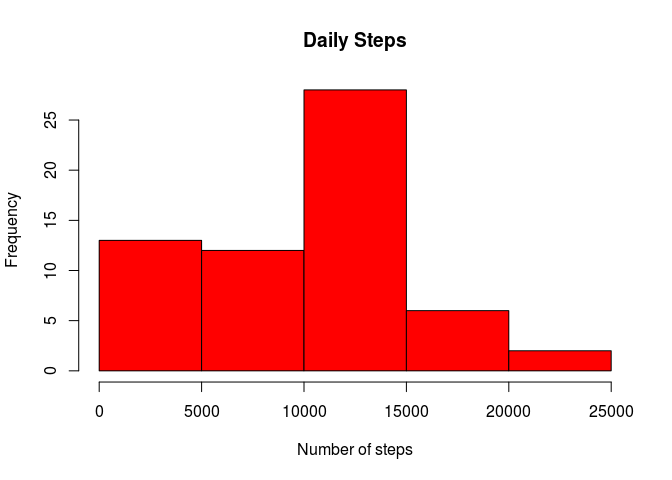
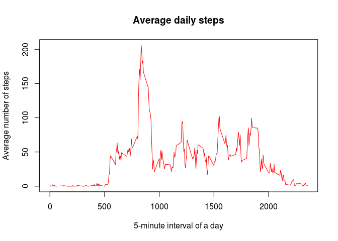
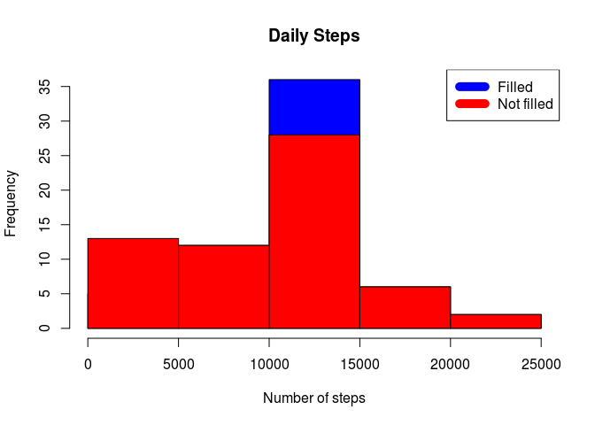
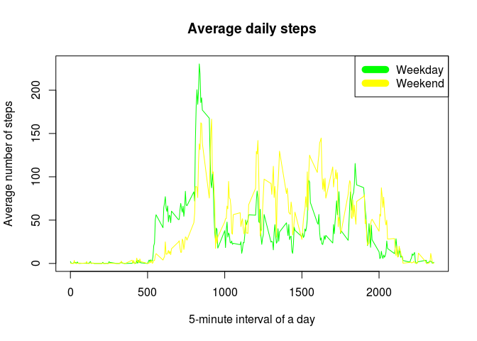

# Reproducible Research: Peer Assessment 1

## Loading and preprocessing the data
  
Load the data (i.e. read.csv()).
  

```r
activity <- read.csv('activity.csv')
```

Process/transform the data into a format suitable for the analysis.


```r
activity$date <- as.Date(activity$date, format="%Y-%m-%d")
```

## What is mean total number of steps taken per day?

Make a histogram of the total number of steps taken each day.


```r
total_steps_by_day <- aggregate(activity$steps, 
                         by=list(activity$date), 
                         FUN=sum, na.rm=TRUE)
colnames(total_steps_by_day) <- c("date", "steps")
hist(total_steps_by_day$steps, 
     col="red", 
     main="Daily Steps", 
     xlab="Number of steps")
```

 

Calculate and report the mean and median total number of steps taken per day.


```r
mean <- mean(total_steps_by_day$steps)
median <- median(total_steps_by_day$steps)
```

The mean is 9354.2295082.

The median is 10395.


## What is the average daily activity pattern?

Make a time series plot (i.e. type = "l") of the 5-minute interval (x-axis) and the average number of steps taken, averaged across all days (y-axis).


```r
average_daily_activity <- aggregate(activity$steps, 
                                    by=list(activity$interval), 
                                    FUN=mean, na.rm=TRUE)
colnames(average_daily_activity) <- c("interval", "steps")
plot(average_daily_activity$interval, 
     average_daily_activity$steps, 
     col="red",
     main="Average daily steps", 
     xlab="5-minute interval of a day", 
     ylab="Average number of steps",
     type="l")
```

 

Get which 5-minute interval, on average across all the days in the dataset, contains the maximum number of steps.


```r
interval_with_maximum_number_of_steps <- 
  average_daily_activity$interval[which.max(average_daily_activity$steps)]
```

The maximum number of steps is in interval 835.


## Imputing missing values

Calculate and report the total number of missing values in the dataset (i.e. the total number of rows with NAs).


```r
na_steps <- table(is.na(activity$steps))
```

There is 2304 rowns with NAs.


Create a new dataset that is equal to the original dataset but with the missing data filled in with the mean for that 5-minute interval.


```r
activity_filled <- activity
activity_filled$steps[is.na(activity_filled$steps)] <- 
  average_daily_activity$steps
```

Make a histogram of the total number of steps taken each day and Calculate and report the mean and median total number of steps taken per day. 
See if these values differ from the estimates from the first part of the assignment.
See what is the impact of imputing missing data on the estimates of the total daily number of steps.


```r
total_steps_by_day_filled <- aggregate(activity_filled$steps, 
                                      by=list(activity_filled$date), 
                                      FUN=sum, na.rm=TRUE)
colnames(total_steps_by_day_filled) <- c("date", "steps")
hist(total_steps_by_day_filled$steps, col="blue", 
     main="Daily Steps", 
     xlab="Number of steps")
hist(total_steps_by_day$steps, col="red", add=TRUE)
legend("topright", c("Filled", "Not filled"), col=c("blue", "red"), lwd=10)
```

 


```r
mean_filled <- mean(total_steps_by_day_filled$steps)
median_filled <- median(total_steps_by_day_filled$steps)
difference_mean <- mean_filled - mean 
difference_median <- median_filled - median
```

The mean with the missing data is 1.0766189\times 10^{4}.

The median with the missing data is 1.0766189\times 10^{4}.

The difference of mean of the two datasets is 1411.959171.

The difference of median of the two datasets is 371.1886792.

## Are there differences in activity patterns between weekdays and weekends?

Create a new factor variable in the dataset with two levels – "weekday" and "weekend" indicating whether a given date is a weekday or weekend day.


```r
weekend_days <- c("samedi", "dimanche")
activity_filled$weekdays <- ifelse(is.element
                                      (weekdays(activity_filled$date),
                                       weekend_days), "weekend", "weekday")
```

Make a panel plot containing a time series plot (i.e. type = "l") of the 5-minute interval (x-axis) and the average number of steps taken, averaged across all weekday days or weekend days (y-axis).


```r
average_daily_activity_filled <- aggregate(activity_filled$steps, 
                                          by=list(activity_filled$interval,
                                                  activity_filled$weekdays), 
                                          FUN=mean, na.rm=TRUE)
colnames(average_daily_activity_filled) <- c("interval", "weekdays", "steps")
plot(
  average_daily_activity_filled$interval[
    average_daily_activity_filled$weekdays=="weekday"], 
  average_daily_activity_filled$steps[
    average_daily_activity_filled$weekdays=="weekday"], 
  col="green",
  main="Average daily steps", 
  xlab="5-minute interval of a day", 
  ylab="Average number of steps",   
  type="l" 
  )
lines(
  average_daily_activity_filled$interval[
    average_daily_activity_filled$weekdays=="weekend"], 
  average_daily_activity_filled$steps[
    average_daily_activity_filled$weekdays=="weekend"], 
  col="yellow"
  )
legend("topright", c("Weekday", "Weekend"), col=c("green", "yellow"), lwd=10)
```

 
